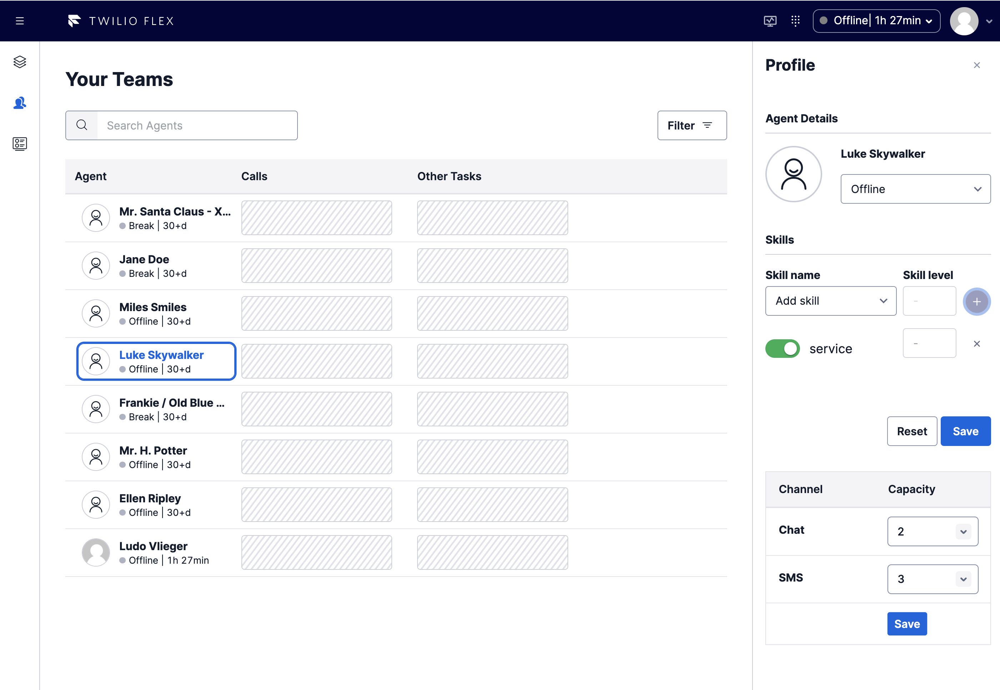

# Supervisor Channel Capacity Plugin

## Your custom Twilio Flex Plugin

Twilio Flex Plugins allow you to customize the appearance and behavior of [Twilio Flex](https://www.twilio.com/flex). If you want to learn more about the capabilities and how to use the API, check out our [Flex documentation](https://www.twilio.com/docs/flex).

## How it works
This Flex plugin adds a Channel Capacity coniguration section under the Skills panel on the Agent Profile window.  This feature enabled Supervisors to update the Agent's Chat and SMS Channel capacity from within Flex.



This plugin leverages Serverless functions to get the Worker Channels and to update the Worker Channel capacity.


# Configuration

## Requirements

To deploy this plugin, you will need:

- An active Twilio account with Flex provisioned. Refer to the [Flex Quickstart](https://www.twilio.com/docs/flex/quickstart/flex-basics#sign-up-for-or-sign-in-to-twilio-and-create-a-new-flex-project%22) to create one.
- npm version 5.0.0 or later installed (type `npm -v` in your terminal to check)
- Node.js version 12 or later installed (type `node -v` in your terminal to check). We recommend the _even_ versions of Node.
- [Twilio CLI](https://www.twilio.com/docs/twilio-cli/quickstart#install-twilio-cli) along with the [Flex CLI Plugin](https://www.twilio.com/docs/twilio-cli/plugins#available-plugins) and the [Serverless Plugin](https://www.twilio.com/docs/twilio-cli/plugins#available-plugins). Run the following commands to install them:

```
# Install the Twilio CLI
npm install twilio-cli -g
# Install the Serverless and Flex as Plugins
twilio plugins:install @twilio-labs/plugin-serverless
twilio plugins:install @twilio-labs/plugin-flex
```

## Setup
This solution contains both the Flex 1.x UI version as well as a new Flex UI 2.0 version.

Install the dependencies by running `npm install`:

```bash
cd supervisor-capacity/plugin-channel-capacity
npm install
```

From the root directory, rename `public/appConfig.example.js` to `public/appConfig.js`.

```bash
mv public/appConfig.example.js public/appConfig.js
```

## Serverless Functions


### Deployment

Create the Serverless config file by copying `.env.example` to `.env`.

```bash
cd serverless
cp .env.example .env
```
Edit `.env` and set the `TWILIO_WORKSPACE_SID` variable to your TaskRouter Workspace Sid. Next, deploy the Serverless functions:

```bash
cd serverless
twilio serverless:deploy
```
After successfully deploying your function, you should see at least the following:
```bash
✔ Serverless project successfully deployed
Domain: channel-capacity-service-xxxx-dev.twil.io

Functions:
   https://channel-capacity-service-xxxx-dev.twil.io/getWorkerChannels
   https://channel-capacity-service-xxxx-dev.twil.io/setWorkerChannelCapacity
```


Your functions will now be present in the Twilio Functions Console and be part of the "channel-capacity-service" service. Copy the base URL from the function.

## Flex Plugin

### Development

Create the plugin config file by copying `.env.example` to `.env`.

```bash
cd plugin-channel-capacity
cp .env.example .env
```

Edit `.env` and set the `FLEX_APP_FUNCTIONS_BASE` variable to your Twilio Functions base URL (like https://channel-capacity-service-xxxx-dev.twil.io). 

To run the plugin locally, you can use the Twilio Flex CLI plugin. Using your command line, run the following from the root directory of the plugin.

```bash
cd plugin-channel-capacity
twilio flex:plugins:start
```

This will automatically start up the webpack dev server and open the browser for you. Your app will run on `http://localhost:3000`.

When you make changes to your code, the browser window will be automatically refreshed.


### Deploy your Flex Plugin

Once you are happy with your Flex plugin, you have to deploy then release it on your Flex application.

Run the following command to start the deployment:

```bash
twilio flex:plugins:deploy --major --changelog "Releasing Supervisor Channel Capacity" --description "Channel Capacity plugin"
```

After running the suggested next step, navigate to the [Plugins Dashboard](https://flex.twilio.com/admin/) to review your recently deployed plugin and confirm that it’s enabled for your contact center.

**Note:** Common packages like `React`, `ReactDOM`, `Redux` and `ReactRedux` are not bundled with the build because they are treated as external dependencies so the plugin will depend on Flex to provide them globally.

You are all set to test this plugin on your Flex application!

## License

[MIT](http://www.opensource.org/licenses/mit-license.html)

## Disclaimer

No warranty expressed or implied. Software is as is.


# Your custom Twilio Flex Plugin

Twilio Flex Plugins allow you to customize the appearance and behavior of [Twilio Flex](https://www.twilio.com/flex). If you want to learn more about the capabilities and how to use the API, check out our [Flex documentation](https://www.twilio.com/docs/flex).

## Setup

Make sure you have [Node.js](https://nodejs.org) as well as [`npm`](https://npmjs.com). We support Node >= 10.12 (and recommend the _even_ versions of Node). Afterwards, install the dependencies by running `npm install`:

```bash
cd 

# If you use npm
npm install
```

Next, please install the [Twilio CLI](https://www.twilio.com/docs/twilio-cli/quickstart) by running:

```bash
brew tap twilio/brew && brew install twilio
```

Finally, install the [Flex Plugin extension](https://github.com/twilio-labs/plugin-flex/tree/v1-beta) for the Twilio CLI:

```bash
twilio plugins:install @twilio-labs/plugin-flex
```

## Development

Run `twilio flex:plugins --help` to see all the commands we currently support. For further details on Flex Plugins refer to our documentation on the [Twilio Docs](https://www.twilio.com/docs/flex/developer/plugins/cli) page.

